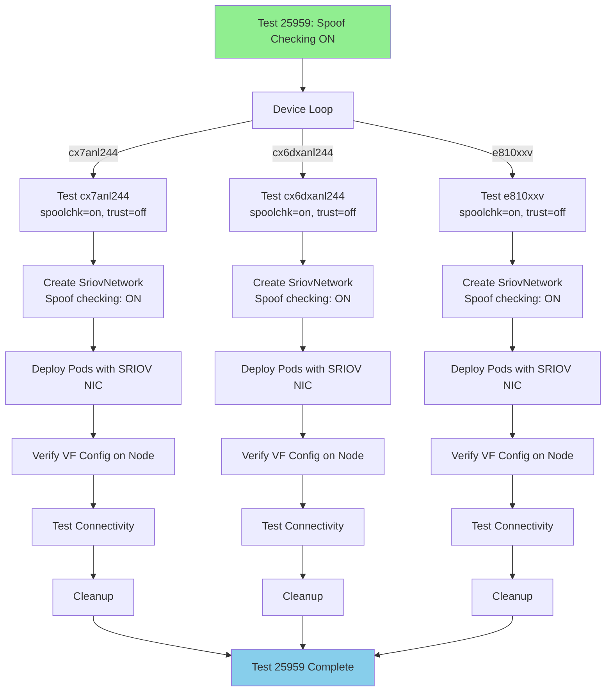
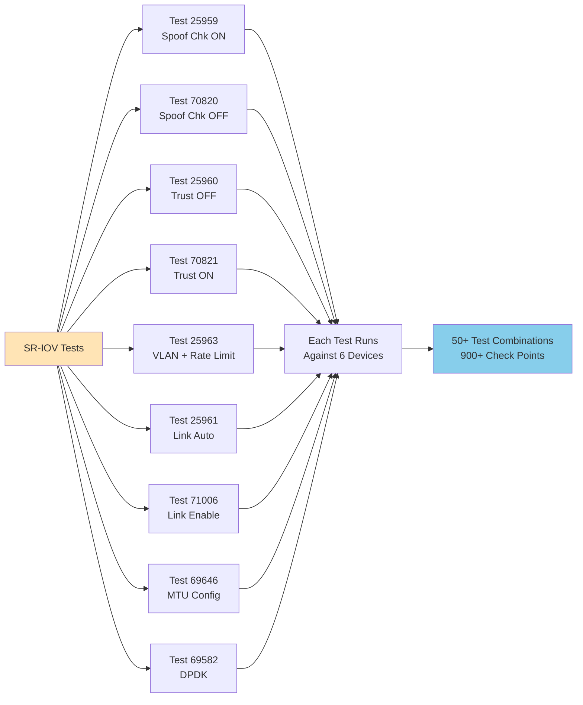
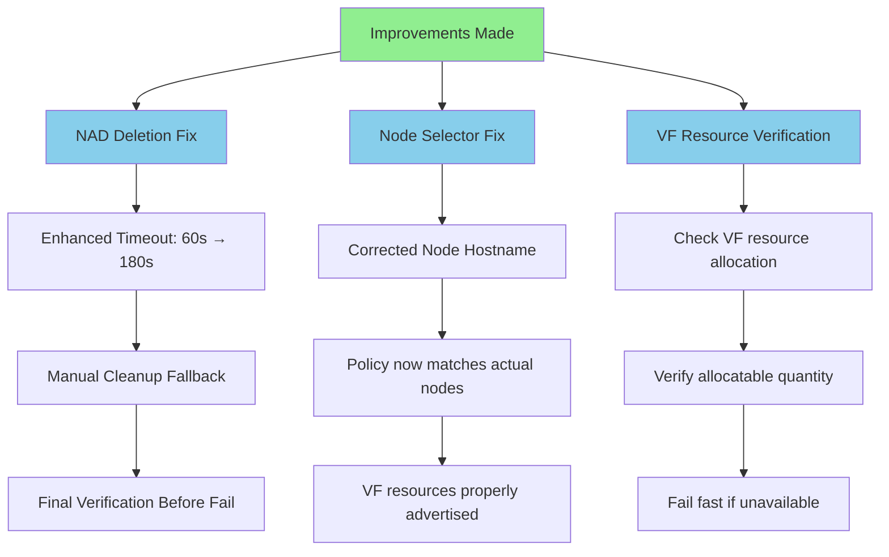
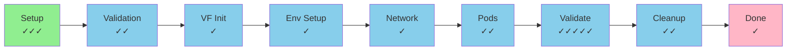
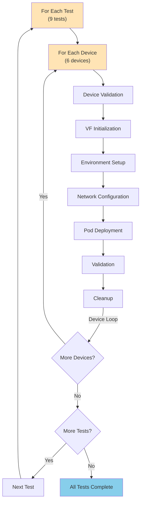

# SR-IOV Tests - Mermaid Flowchart

## Main Test Flow

```mermaid
graph TD
    A["🚀 START: SR-IOV Test Suite"] --> B["SETUP PHASE"]
    
    B --> B1["✓ Cluster Connected"]
    B1 --> B2["✓ SR-IOV Operator Running"]
    B2 --> B3["✓ All 4 Operator Components"]
    B3 --> B4["Load Test Data: 9 Tests, 6 Devices"]
    B4 --> C["📋 SELECT TEST<br/>25959/70820/25960/70821/25963/25961/71006/69646/69582"]
    
    C --> D["🔄 FOR EACH DEVICE<br/>e810xxv, e810c, x710, bcm57414, bcm57508, e810back"]
    
    D --> E["DEVICE VALIDATION PHASE"]
    E --> E1["✓ Device Exists on Workers?"]
    E1 -->|No| E2["⏭️  SKIP Device"]
    E1 -->|Yes| E3["✓ Device Supports Test Config?"]
    E2 --> D
    E3 -->|No| E2
    E3 -->|Yes| F["✓ Device Validated"]
    
    F --> G["VF INITIALIZATION PHASE"]
    G --> G1["✓ Create SriovNetworkNodePolicy<br/>Name: TestID-DeviceName"]
    G1 --> G2["✓ Wait for Policy Ready<br/>Timeout: 30 min, Status: Succeeded"]
    G2 --> H["ENVIRONMENT SETUP PHASE"]
    
    H --> H1["✓ Create Test Namespace<br/>Name: e2e-TestID-DeviceName"]
    H1 --> H2["✓ Set Privileged: true"]
    H2 --> I["NETWORK CONFIGURATION PHASE"]
    
    I --> I1["✓ Create SriovNetwork CR<br/>Unique Name per test/device"]
    I1 --> I2["✓ Wait for NAD Creation<br/>Timeout: 180s (enhanced)"]
    I2 -->|Timeout| I3["⚠️  Manual Cleanup + Retry"]
    I2 -->|Success| J["POD DEPLOYMENT PHASE"]
    I3 -->|Still Failed| Z1["❌ TEST FAILED"]
    
    J --> J1["✓ Create Client Pod<br/>IP: 192.168.1.10, MAC: 20:04:0f:f1:88:01"]
    J1 --> J2["✓ Create Server Pod<br/>IP: 192.168.1.11, MAC: 20:04:0f:f1:88:02"]
    J2 --> J3["✓ Wait for Pods Ready<br/>Timeout: 300s"]
    J3 --> K["VALIDATION PHASE"]
    
    K --> K1["✓ Verify Interface Configuration"]
    K1 --> K2["✓ Verify Test-Specific Config<br/>spoof/trust/vlan/mtu/etc"]
    K2 --> K3["✓ Check Link Status"]
    K3 -->|NO-CARRIER| K4["⏭️  Skip Traffic Tests<br/>Expected for x710, bcm57508"]
    K3 -->|OK| K5["✓ IPv4 Connectivity Ping"]
    K4 --> K6["POD DEPLOYMENT SUCCESSFUL"]
    K5 --> K7["✓ IPv6 Connectivity Ping"]
    K7 --> K8["✓ HTTP/App Traffic Test"]
    K8 --> K6["✓ ALL VALIDATION PASSED"]
    
    K6 --> L["CLEANUP PHASE"]
    L --> L1["✓ Remove SriovNetwork<br/>Timeout: 180s (enhanced)"]
    L1 -->|Timeout| L2["⚠️  Manual Force Delete"]
    L1 -->|Success| L3["✓ NAD Deleted"]
    L2 --> L3
    L3 --> L4["✓ Delete Test Namespace"]
    L4 --> M["✅ TEST PASSED"]
    
    M --> N{More Devices?}
    N -->|Yes| D
    N -->|No| O{More Tests?}
    
    O -->|Yes| C
    O -->|No| P["📊 TEST SUMMARY<br/>Tests Passed: X/9<br/>Devices Tested: 50+<br/>Resources Cleaned: ✓"]
    
    Z1 --> P
    P --> Q["🏁 END: SR-IOV Test Suite"]
    
    style A fill:#90EE90
    style Q fill:#FFB6C6
    style M fill:#87CEEB
    style Z1 fill:#FF6B6B
    style K6 fill:#87CEEB
    style P fill:#FFE4B5
```

## Detailed Per-Test Loop

```mermaid
graph TD
    A["Test 25959: Spoof Checking ON"] --> B["Device Loop"]
    
    B -->|cx7anl244| C1["Test cx7anl244<br/>spoolchk=on, trust=off"]
    B -->|cx6dxanl244| C2["Test cx6dxanl244<br/>spoolchk=on, trust=off"]
    B -->|e810xxv| C3["Test e810xxv<br/>spoolchk=on, trust=off"]
    
    C1 --> D1["Create SriovNetwork<br/>Spoof checking: ON"]
    C2 --> D2["Create SriovNetwork<br/>Spoof checking: ON"]
    C3 --> D3["Create SriovNetwork<br/>Spoof checking: ON"]
    
    D1 --> E1["Deploy Pods with SRIOV NIC"]
    D2 --> E2["Deploy Pods with SRIOV NIC"]
    D3 --> E3["Deploy Pods with SRIOV NIC"]
    
    E1 --> F1["Verify VF Config on Node"]
    E2 --> F2["Verify VF Config on Node"]
    E3 --> F3["Verify VF Config on Node"]
    
    F1 --> G1["Test Connectivity"]
    F2 --> G2["Test Connectivity"]
    F3 --> G3["Test Connectivity"]
    
    G1 --> H1["Cleanup"]
    G2 --> H2["Cleanup"]
    G3 --> H3["Cleanup"]
    
    H1 --> I["Test 25959 Complete"]
    H2 --> I
    H3 --> I
    
    style A fill:#90EE90
    style I fill:#87CEEB
```

## Test Types Overview

```mermaid
graph LR
    A["SR-IOV Tests"] --> B1["Test 25959<br/>Spoof Chk ON"]
    A --> B2["Test 70820<br/>Spoof Chk OFF"]
    A --> B3["Test 25960<br/>Trust OFF"]
    A --> B4["Test 70821<br/>Trust ON"]
    A --> B5["Test 25963<br/>VLAN + Rate Limit"]
    A --> B6["Test 25961<br/>Link Auto"]
    A --> B7["Test 71006<br/>Link Enable"]
    A --> B8["Test 69646<br/>MTU Config"]
    A --> B9["Test 69582<br/>DPDK"]
    
    B1 --> C["Each Test Runs<br/>Against 6 Devices"]
    B2 --> C
    B3 --> C
    B4 --> C
    B5 --> C
    B6 --> C
    B7 --> C
    B8 --> C
    B9 --> C
    
    C --> D["50+ Test Combinations<br/>900+ Check Points"]
    
    style A fill:#FFE4B5
    style D fill:#87CEEB
```

## Key Enhancements Applied

```mermaid
graph TD
    A["Improvements Made"] --> B["NAD Deletion Fix"]
    A --> C["Node Selector Fix"]
    A --> D["VF Resource Verification"]
    
    B --> B1["Enhanced Timeout: 60s → 180s"]
    B1 --> B2["Manual Cleanup Fallback"]
    B2 --> B3["Final Verification Before Fail"]
    
    C --> C1["Corrected Node Hostname"]
    C1 --> C2["Policy now matches actual nodes"]
    C2 --> C3["VF resources properly advertised"]
    
    D --> D1["Check VF resource allocation"]
    D1 --> D2["Verify allocatable quantity"]
    D2 --> D3["Fail fast if unavailable"]
    
    style A fill:#90EE90
    style B fill:#87CEEB
    style C fill:#87CEEB
    style D fill:#87CEEB
```

## Phase Checklist

```mermaid
graph LR
    A["Setup<br/>✓✓✓"] --> B["Validation<br/>✓✓"]
    B --> C["VF Init<br/>✓"]
    C --> D["Env Setup<br/>✓"]
    D --> E["Network<br/>✓"]
    E --> F["Pods<br/>✓✓"]
    F --> G["Validate<br/>✓✓✓✓✓"]
    G --> H["Cleanup<br/>✓✓"]
    H --> I["Done<br/>✓"]
    
    style A fill:#90EE90
    style B fill:#87CEEB
    style C fill:#87CEEB
    style D fill:#87CEEB
    style E fill:#87CEEB
    style F fill:#87CEEB
    style G fill:#87CEEB
    style H fill:#87CEEB
    style I fill:#FFB6C6
```

## Nested Loop Structure

```mermaid
graph TD
    A["For Each Test<br/>(9 tests)"] --> B["For Each Device<br/>(6 devices)"]
    B --> C["Device Validation"]
    C --> D["VF Initialization"]
    D --> E["Environment Setup"]
    E --> F["Network Configuration"]
    F --> G["Pod Deployment"]
    G --> H["Validation"]
    H --> I["Cleanup"]
    
    I -->|Device Loop| J{More Devices?}
    J -->|Yes| B
    J -->|No| K{More Tests?}
    
    K -->|Yes| L["Next Test"]
    K -->|No| M["All Tests Complete"]
    
    L --> A
    
    style A fill:#FFE4B5
    style B fill:#FFE4B5
    style M fill:#87CEEB
```

